# 🏥 Smart Medical Appointment System

A **web-based Medical Appointment Booking System** built using the **MERN Stack (MongoDB, Express.js, React.js, Node.js)**.  
This project is focusing on **appointment scheduling, availability management, and role-based access** for Admins, Doctors, and Patients.


## 📌 1. Project Overview

The **Smart Medical Appointment System** simplifies the process of booking and managing doctor appointments online.  
It provides separate dashboards for **Admin**, **Doctor**, and **Patient**, ensuring a smooth and secure workflow.

### Who can use it?
- **Patients** – Book and manage appointments online
- **Doctors** – Control availability and manage appointments
- **Admins** – Manage users, doctors, and the overall system

---

## ❓ 2. Problem Statement

Traditional appointment booking systems rely heavily on:
- Manual scheduling
- Phone calls
- Long waiting times
- Poor availability tracking

These issues lead to inefficiency, miscommunication, and inconvenience for both patients and doctors.

---

## 🎯 3. Objectives of the System

- Digitize medical appointment booking
- Reduce manual workload for clinics
- Provide real-time availability management
- Ensure secure, role-based access
- Offer a user-friendly interface for all users

---

## ✨ 4. Features (Panel-wise)

### 🔐 Admin Panel
- Admin authentication (secure login)
- Add & manage doctors
- Assign doctor credentials (auto-generated)
- View all appointments
- Manage users (doctors & patients)
- System-wide monitoring
- View all feedbacks
- View all health tips

### 🩺 Doctor Panel
- Secure login
- Manage availability (days & time slots)
- View upcoming appointments
- Accept / reject appointments
- Update profile information
- Give health tips

### 👤 Patient Panel
- User registration & login
- Browse doctors by specialization
- Book appointments
- View appointment history
- Cancel appointments (within allowed rules)
- Profile management
- Give the feedback

---

## 🔐 5. Security Features
- JWT-based authentication
- Role-based access control
- Protected API routes
- Password hashing
- Input validation & sanitization

---

## 🔁 6. Auto-Generated Password Feature

- When Admin adds a Doctor, the system:
  - Auto-generates a secure password
  - Stores it in hashed form

---

## 🛠️ 7. Tech Stack Used

| Layer | Technology |
|-----|-----------|
| Frontend | React.js (Vite), CSS Modules |
| Backend | Node.js, Express.js |
| Database | MongoDB (Atlas) |
| Authentication | JWT (JSON Web Tokens) |
| Deployment | Render (Backend), Vercel (Frontend) |
| Version Control | Git & GitHub |

---

## 🧱 8. System Architecture (High-Level)
```text

Client (React.js)
|
| HTTP Requests (REST APIs)
|
Backend (Node.js + Express.js)
|
| Mongoose ODM
|
Database (MongoDB Atlas)
```


- Frontend communicates with backend using REST APIs
- Backend handles authentication, business logic, and data validation
- MongoDB stores all application data securely

---

## 📁 9. Folder Structure

### Backend (`/Server`)
```text
Server/
├── controllers/
├── models/
├── routes/
├── middleware/
├── utils/
├── config/
├── server.js
└── .env
```


### Frontend (`/Client`)
```text
Client/
├── src/
│ ├── Admin/
│ ├── Doctor/
│ ├── User/
│ ├── App.jsx
│ └── main.jsx
├── public/
└── vite.config.js
```
---
## 🔑 10. Environment Variables
### Backend .env Example
```bash
PORT=8000
MONGO_URI=your_mongodb_atlas_url
JWT_SECRET=your_jwt_secret
```

---

## ▶️ 11. How to Run Locally
### Backend(Server)
```bash
cd Server
npm install
npm start
```

### Frontend(Client)
```bash
cd Client
npm install
npm run dev
```

---

## ⚙️ 12. Installation & Setup
### Prerequisites
- Node.js (v18+ recommended)
- MongoDB Atlas account
- Git

---

## 🔮 13. Future Enhancements
- Email & SMS notifications
- Doctor ratings & reviews
- Calendar integration
- Video consultation
- AI-based slot recommendations

  ---

## ▶️ 14. Live Demo
**Live URL:** [https://smart-medical-appointment-system-wi.vercel.app/](https://smart-medical-appointment-system-wi.vercel.app/) 


---

## 🖼️ 15. Screenshots

### Admin Panel
 - Admin Dashboard
 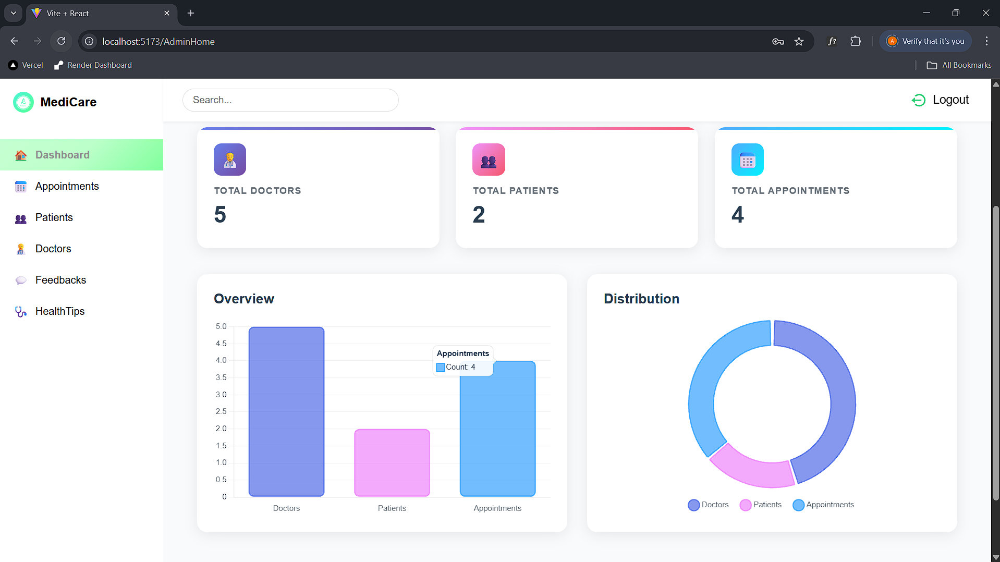

- Add Doctor
 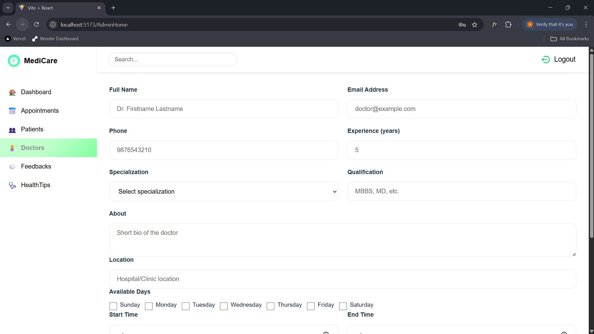

- Manage Doctors
 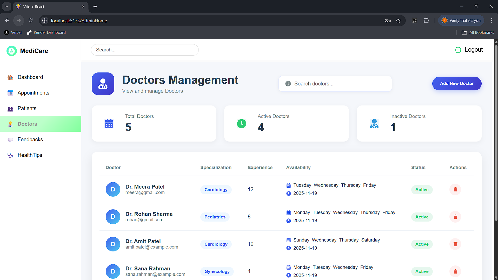

- Manage Patient
 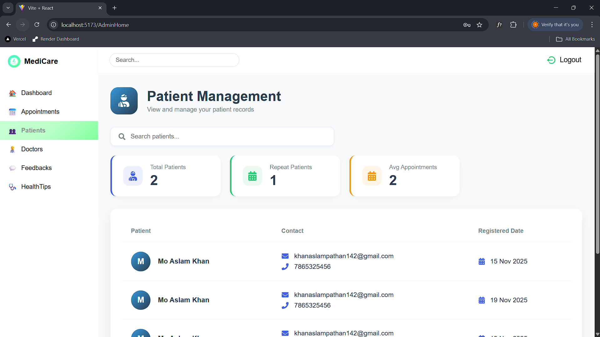

- Manage Appointment
 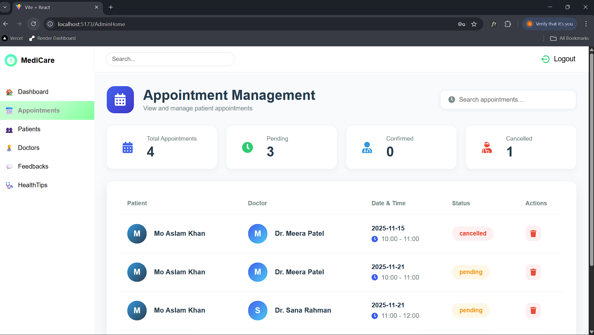

### Doctor Panel

- Doctor Login
 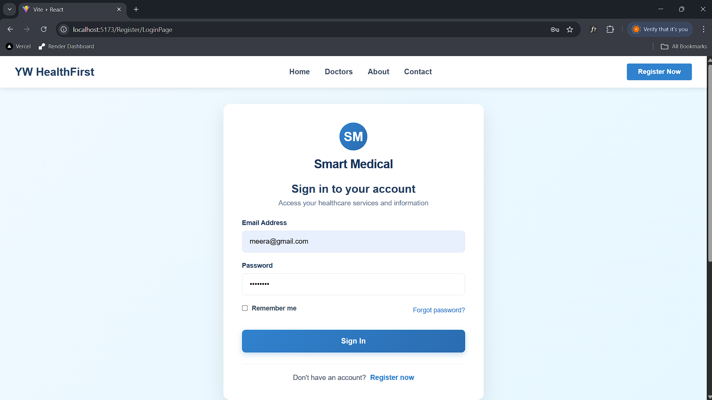

- Doctor Dashboard
 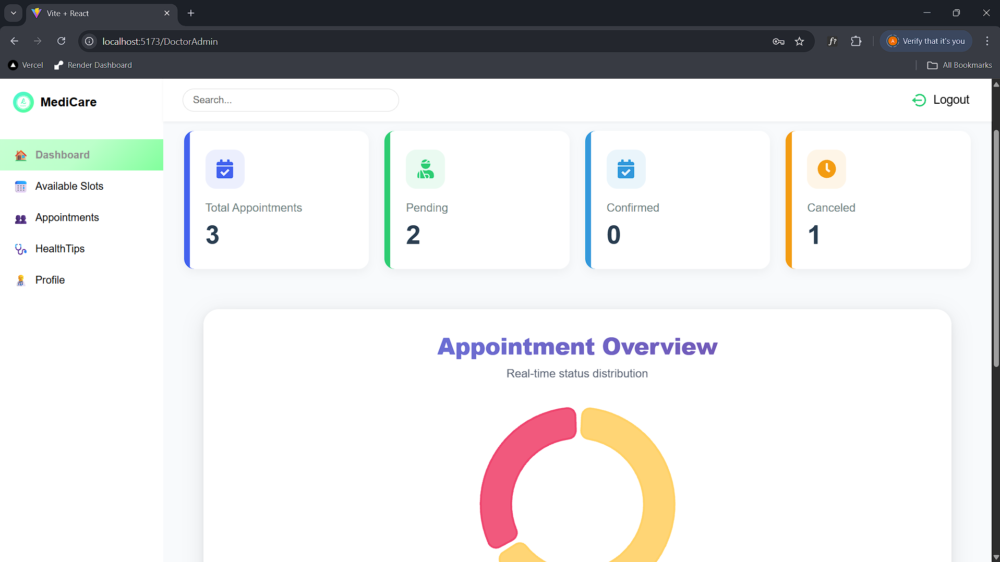

- Manage Appointment
 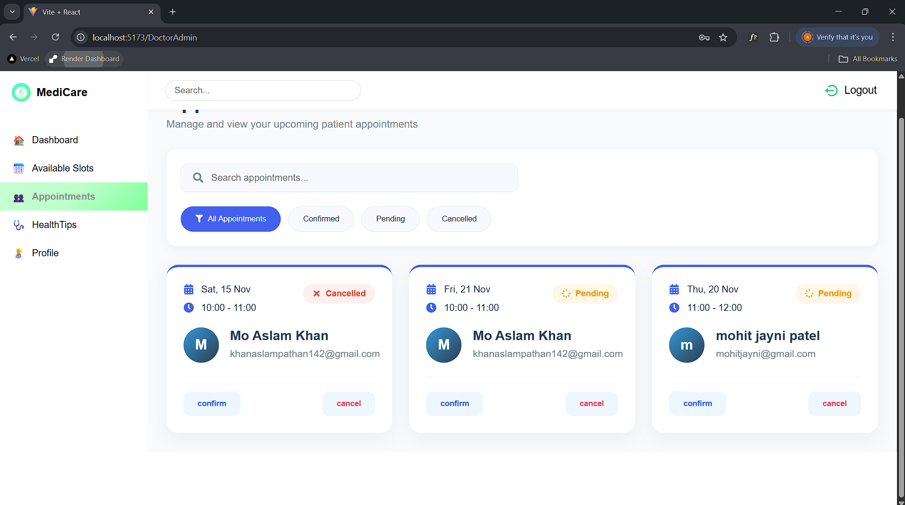

- Doctor Profile
 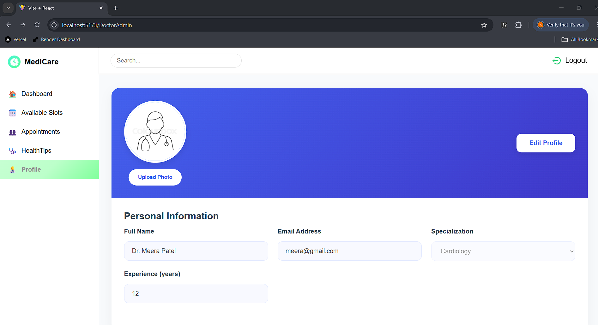

### Patient Panel
- User Register
 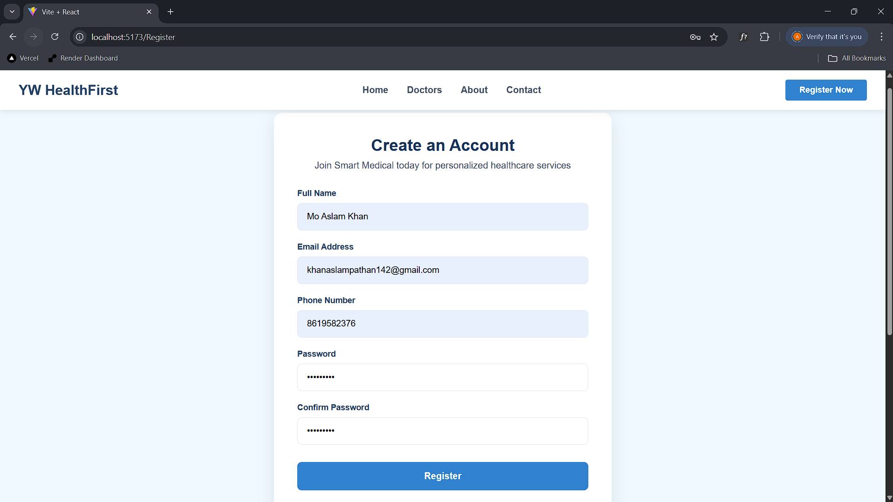

- Patient Profile
 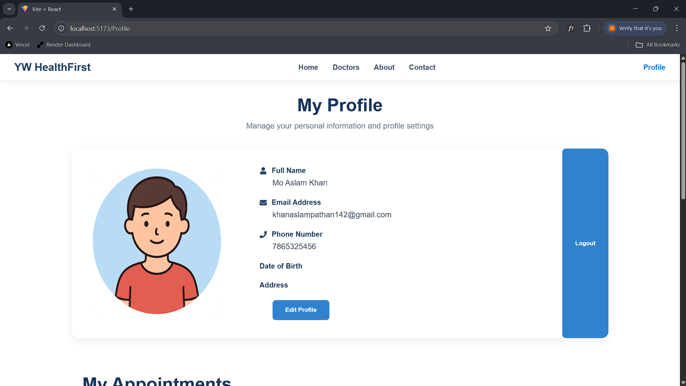

- Find Doctors
 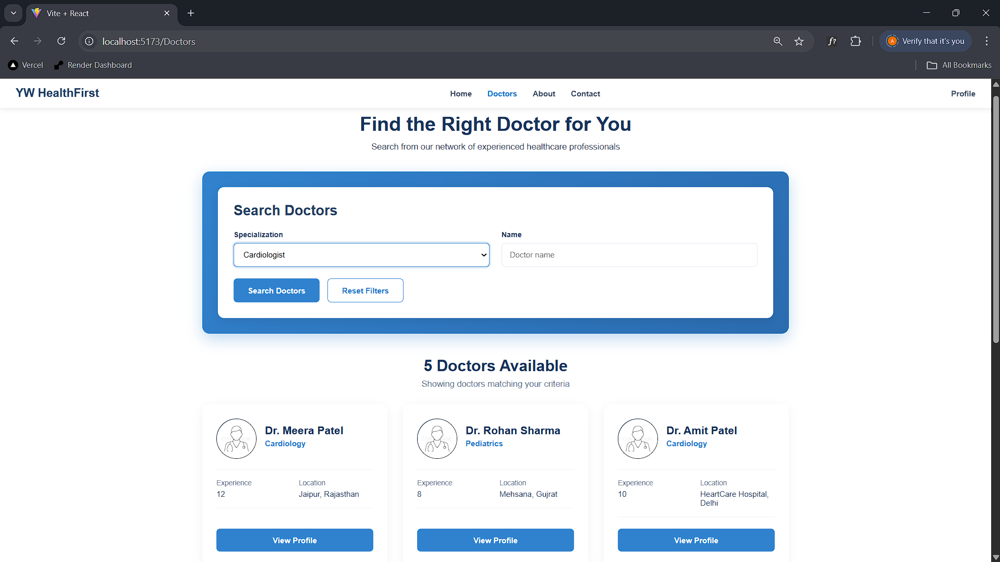

- Doctor Profile
 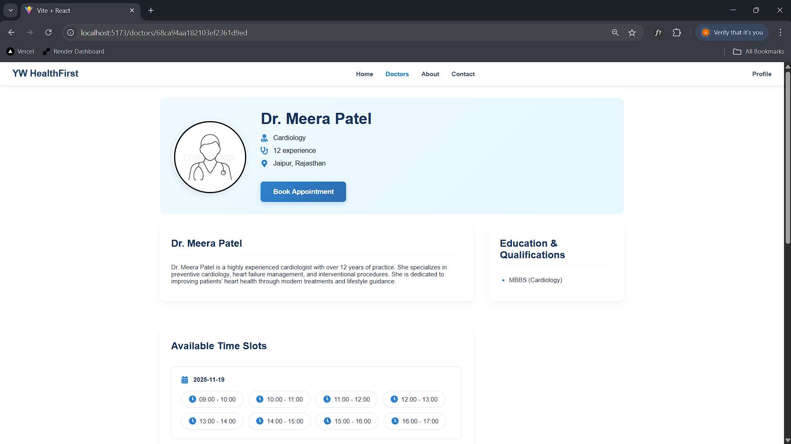

- Book Appointment
 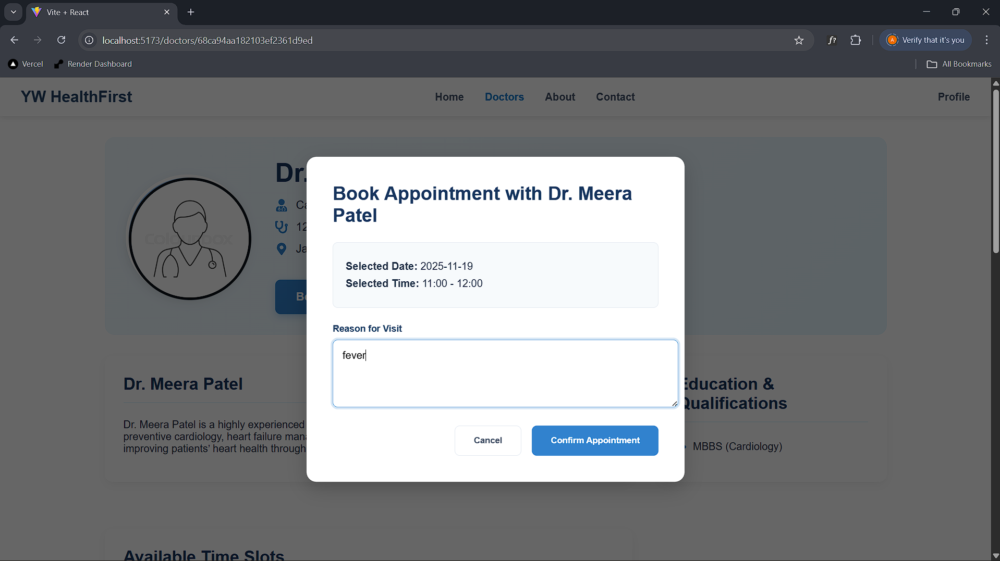

- Patient Appointment
 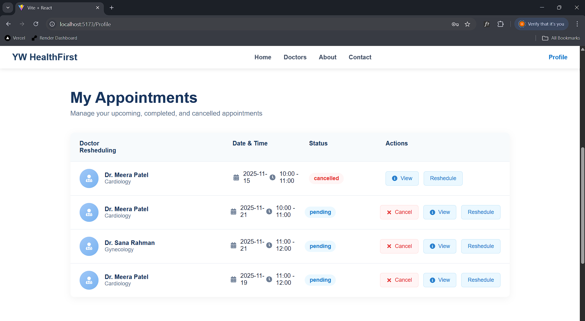

---

## 📌 16. GitHub Repository Notes
- This project is for educational purposes
- No real patient or doctor data is used
- API keys & secrets are excluded
- Proper commit history maintained

---


## 👨‍💻 17. Author

**MO Aslam Khan**

If you have any questions, issues, or suggestions regarding this project, please reach out to me via email.

📧 **Email:** [khanaslampathan142@gmail.com](mailto:khanaslampathan142@gmail.com)  
💼 **Portfolio:** [your-portfolio-link.com](https://portfolio-vert-six-50.vercel.app/)


